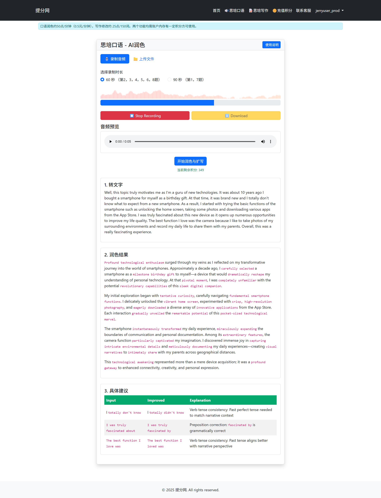
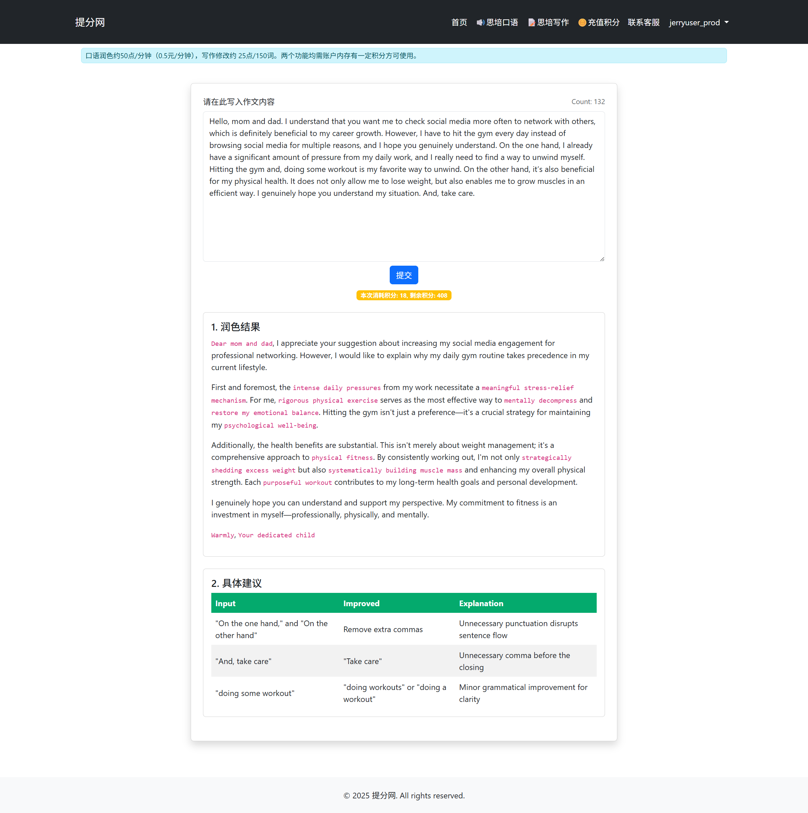

# CELPIP Exam Helper Powered by LLM

## About
This project is an application to help CELPIP (Canadian English Language Proficiency Index Program) students improve their speaking and writing skills. It's currently hosted on an VPS which is accessible at [https://tifen.harrylearns.com](https://tifen.harrylearns.com). 

## Features
- Users can either record their speaking (or upload their audio file) and get immediate feedback from LLM, including a revised version of the practice and grammar corrections.
- Prompts are engineered specifially for CELPIP test, inspired by [YouTuber - HZad Education](https://www.youtube.com/@hzadeducation-coachingcent986/playlists).
- Users can deposit credits to their account and only pay for the number of LLM tokens they use.

## Tech Stack
- Backend: Django
- Frontend: Svelte 
- LLM: OpenAI, Claude
- Testing: GitHub Actions, Pytest, Playwright
- Deployment: Docker, Coolify (an open-source PaaS alternative to Heroku)
- Infrastructure: Debian Linux (hosted on a VPS)

## To-do
- [ ] Add dark/light mode switch
- [ ] Add multi-language support

## Screenshots
### Speaking
Users can record or upload their practices and get feedbacks.

### Writing
Users can type directly at the website and get feedbacks.

